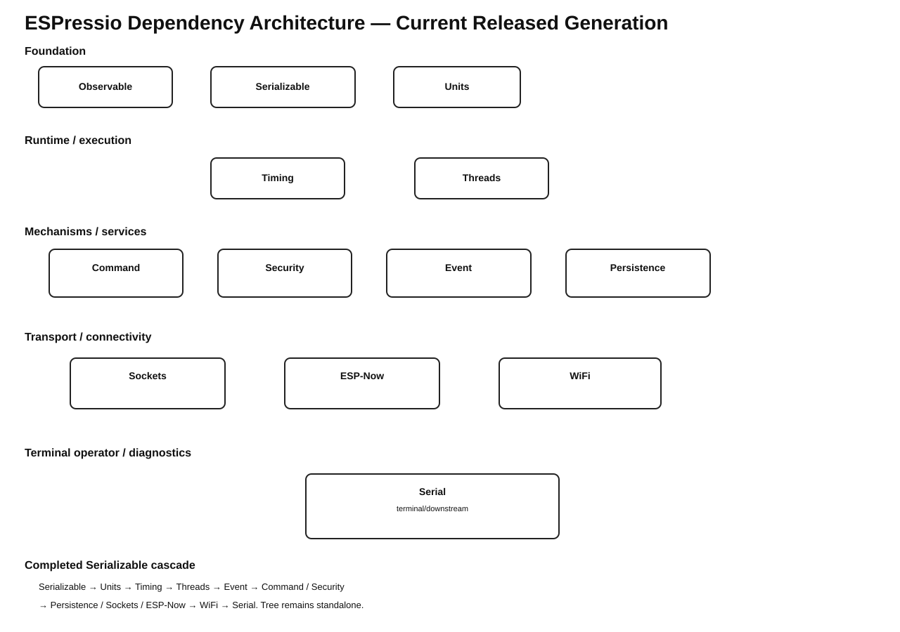

# ESPressio Dependency Chart



## ESPressio Timing 2.2.4

Timing has two required ESPressio dependencies:

```text
ESPressio Timing 2.2.4
    -> ESPressio Units >= 0.2.3 < 1.0.0
    -> ESPressio Observable >= 3.0.1 < 4.0.0
```

Timing deliberately has **no direct ESPressio Serializable dependency**. Applications may choose Serializable time representations through the opt-in Serializable Unit types supplied by Units 0.2.3.

## Current coordinated ecosystem

```text
FOUNDATIONAL
├── Observable 3.0.1
├── Serializable 0.10.2
├── Units 0.2.3
├── Security 0.3.0
└── Command 0.4.0

RUNTIME
└── Timing 2.2.4

EXECUTION
└── Threads 3.1.4

EVENT
└── Event 6.0.0

TRANSPORT / INTEGRATION
├── Sockets 0.6.0
└── ESP-Now 0.6.0

DIAGNOSTICS / OPERATOR
└── Serial 0.6.0
```

## Dependency-direction rule

Dependencies cascade downstream. Event 6.0.0 removed the old reverse dependencies on ESP-Now, Sockets, Command, and Security; those domain libraries now own their concrete Event integrations.

```text
Command  - - -> Event
Security - - -> Event
Sockets  - - -> Event
ESP-Now  - - -> Event

Event -> Command   NONE
Event -> Security  NONE
Event -> Sockets   NONE
Event -> ESP-Now   NONE
```

Timing remains an upstream required dependency of Event. The SystemClock/Timing Event bridge intentionally remains in Event because Event already consumes Timing for its own mechanism; moving the bridge into Timing would create a reverse Timing -> Event dependency.

No reciprocal dependency should be introduced.
