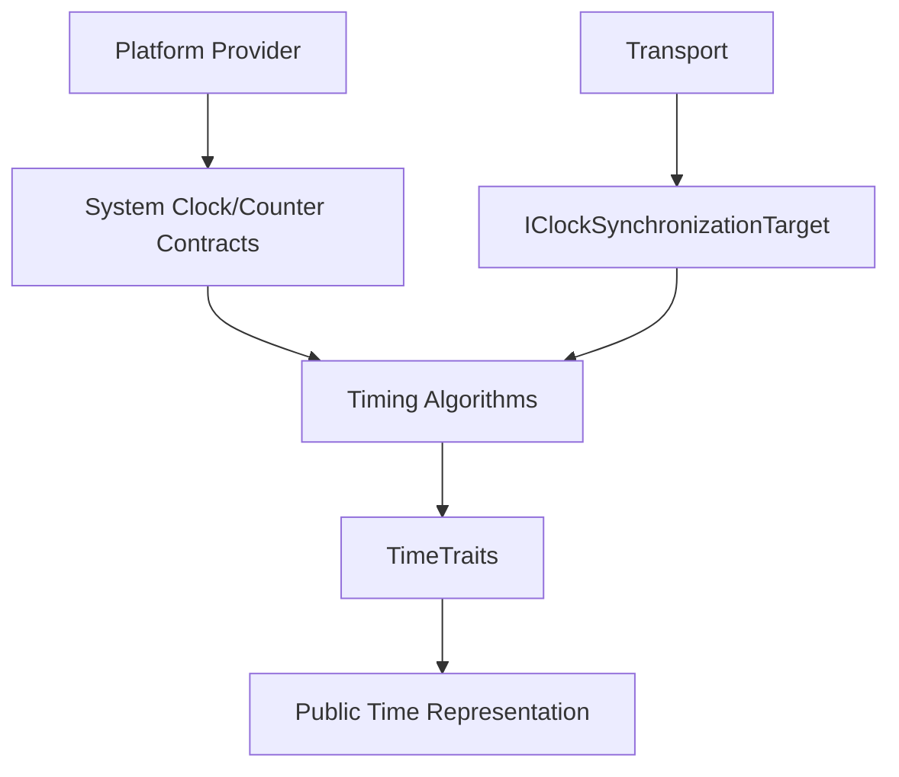

# Extension Architecture

Timing extensions should preserve three independent boundaries: platform time acquisition, timing-domain algorithms, and public time representation.

## Timing owns

Clock/stopwatch semantics, System Clock state, synchronization sample interpretation, discipline/slew/drift, scheduling, observer notifications and `TimeTraits` integration.

## Timing does not own

Native timer drivers/handles, ESP-IDF/Arduino timer selection, network/radio packet formats, peer discovery/election, or serialization of live clock state.

## Extension rule

Add target hardware support beneath ESPressio System. Add transport synchronization outside Timing through `IClockSynchronizationTarget`. Add public value representations through `TimeTraits`. Add new Timing clock abstractions only when the semantics themselves belong to the Timing domain.