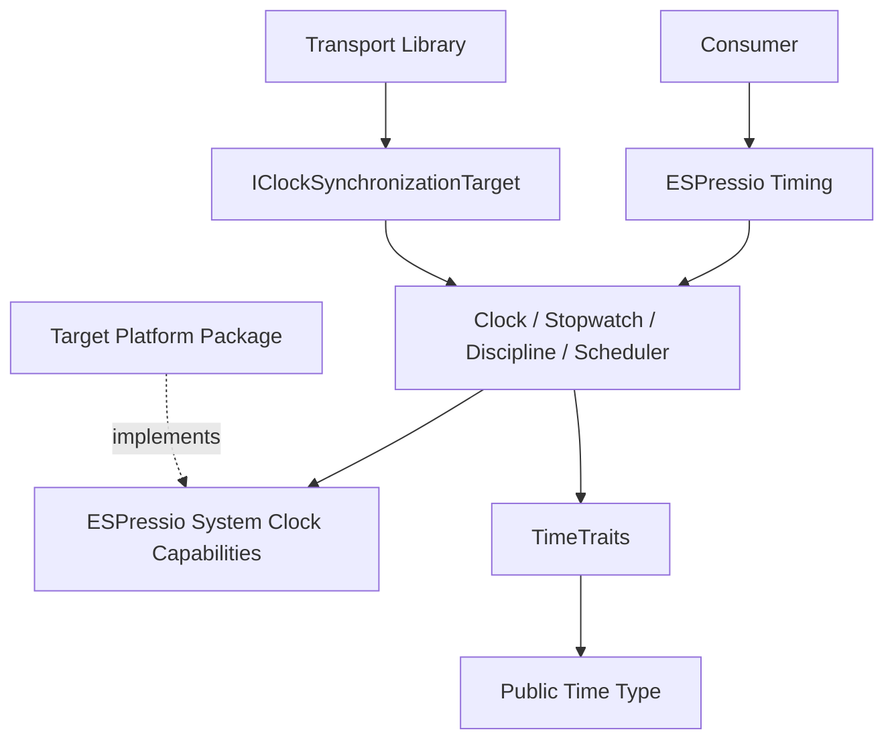

# ESPressio Timing

> Documentation baseline: **1.0.0**

ESPressio Timing provides high-resolution clocks, stopwatches, a disciplined System Clock, synchronization, scheduling and generic public time representations for the ESPressio Development Platform.

Timing owns **time semantics and discipline**. Primitive monotonic-clock and dedicated high-resolution-counter capabilities come from ESPressio System; concrete target timer implementations belong in the target platform package.

## Choose your documentation path

### Using the library

- [Getting Started](Getting-Started)
- [Clock Model](Clock-Model)
- [Stopwatch Clocks](Stopwatch-Clocks)
- [System Clock](System-Clock)
- [Clock Synchronization](Clock-Synchronization)
- [Clock Discipline and Slewing](Clock-Discipline-and-Slewing)
- [System Clock Scheduling](System-Clock-Scheduling)
- [Timing Observers](Timing-Observers)
- [Time Representations and TimeTraits](Time-Representations-and-TimeTraits)
- [High Resolution Sources](High-Resolution-Sources)

### Extending the library

- [Extension Architecture](Extension-Architecture)
- [Platform Clock Boundary](Platform-Clock-Boundary)
- [Custom Time Representations](Custom-Time-Representations)
- [Synchronization Transport Integration](Synchronization-Transport-Integration)
- [Adding Clock Types](Adding-Clock-Types)
- [Testing Timing Extensions](Testing-Timing-Extensions)

## Architecture

For the disciplined System Clock API, prefer the unambiguous `ESPressio_TimingSystemClock.hpp` include.